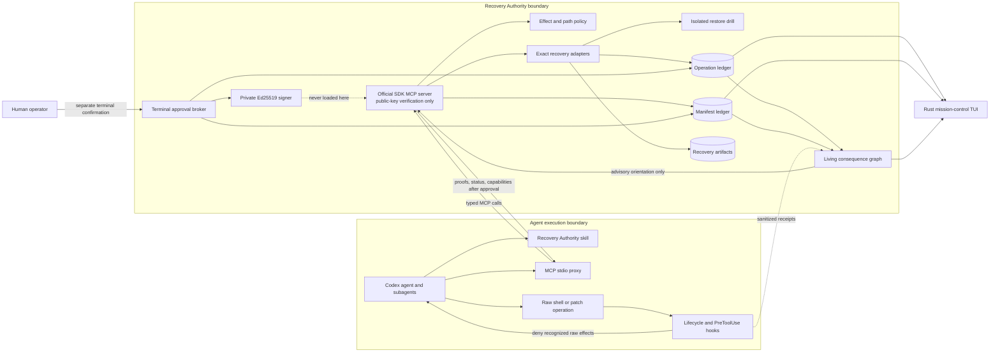
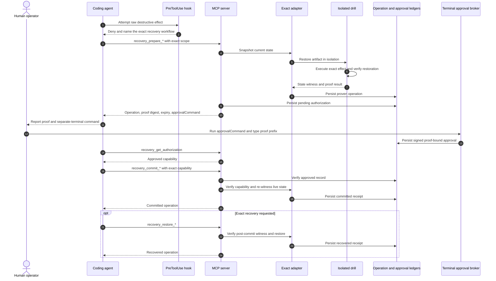
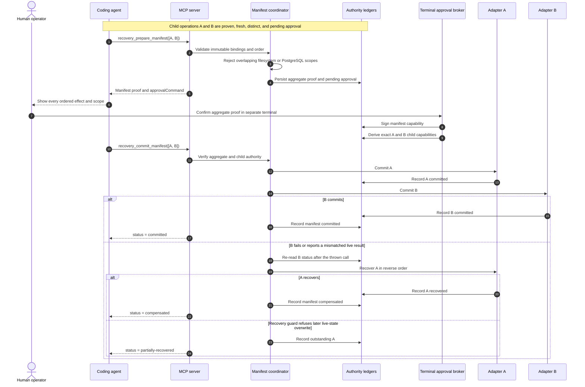
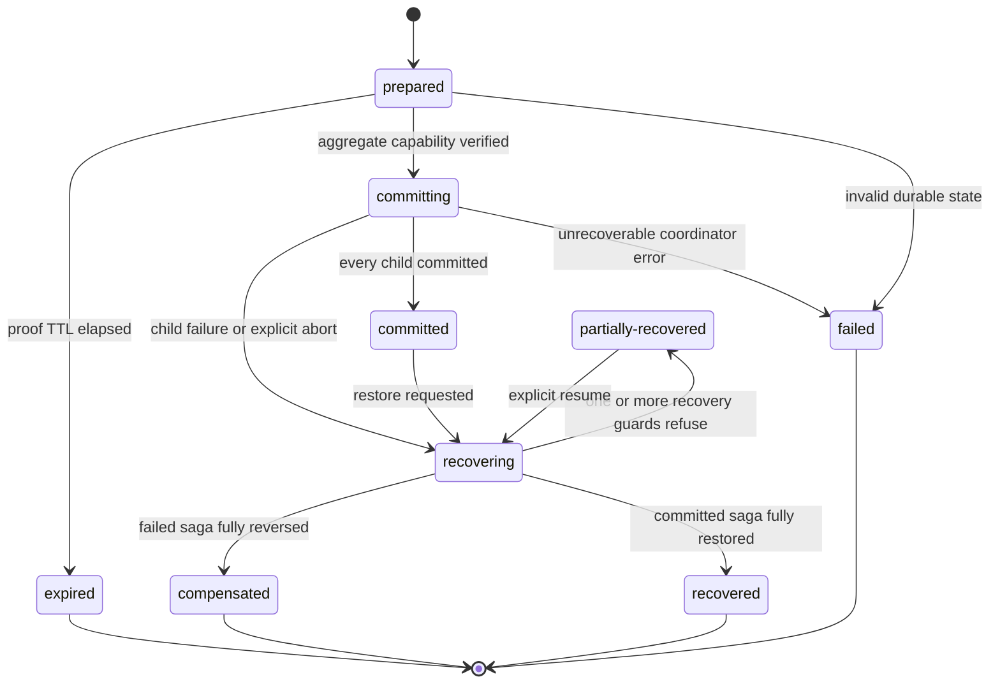
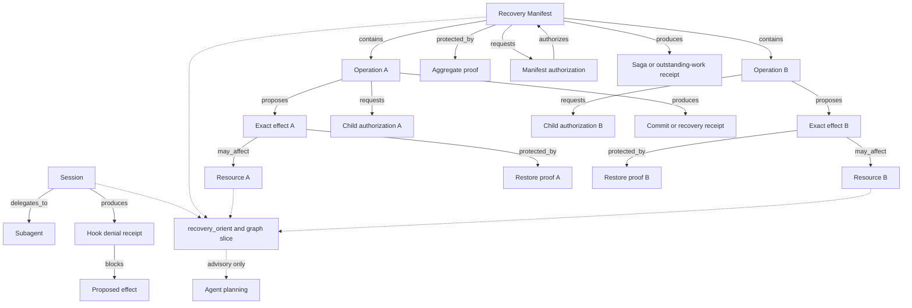
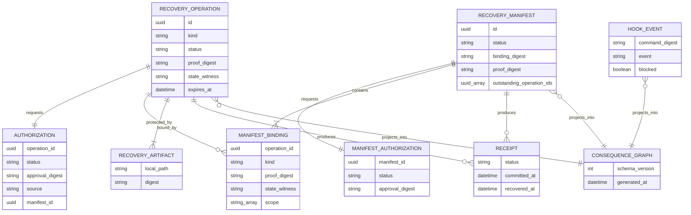

# Recovery Authority Architecture

Recovery Authority is a recovery-backed authorization runtime for coding agents. It separates consequence analysis, recovery proof generation, human approval, and destructive execution so that no model-facing process can mint its own authority.

The core invariant is:

> A destructive effect is executable only through an exact adapter after successful restore testing and separate proof-bound human approval.

## System overview



### Trust boundaries

| Boundary | Trusted responsibility | Explicitly not trusted |
| --- | --- | --- |
| Agent and descendants | Request typed operations and report results | Classifying their own effects, issuing approval, or holding signing keys |
| Codex hooks | Intercept recognized tool effects and emit sanitized receipts | Comprehensive process isolation when hooks are disabled or bypassed outside Codex |
| MCP server | Prepare proofs, verify public capabilities, re-witness state, and dispatch exact adapters | Minting capabilities or converting graph state into authority |
| Terminal approval broker | Display exact scope and proof, confirm human input, and sign capabilities | Model-controlled or non-interactive approval by default |
| Recovery adapters | Snapshot, drill, commit, and restore one supported effect kind | Generic compensation for unsupported or opaque effects |
| Linux sandbox runner | Keep host authority state outside the agent mount namespace | Protecting arbitrary remote systems or providing distributed locks |

## Single-operation protocol



The raw command remains blocked after approval. The capability is accepted only by its corresponding exact MCP commit tool.

## Recovery Manifest saga

A Recovery Manifest composes two to twenty independent, already proven operations. It provides one aggregate review while preserving exact child authority.



### Manifest state machine



This is a compensated saga, not a distributed transaction. It does not claim cross-system atomicity, isolation, or invisible intermediate states.

## Living consequence graph

The consequence graph is a bounded, derived projection for agent orientation and the TUI. It reduces repeated context reconstruction without becoming an authorization source.



`recovery_orient` returns:

- blast radius;
- recovery coverage;
- authority readiness;
- dependency closure;
- uncertainty;
- proof freshness;
- the minimum safe cut still preventing execution.

The graph stores digests rather than raw commands and never stores capability tokens. Exact readiness requires an operation ID or manifest ID; category similarity cannot transfer authority.

## Durable state model



Local authority state is stored with owner-only permissions and atomic file replacement:

```text
RECOVERY_AUTHORITY_DATA_DIR/
  operations.json
  manifests.json
  approvals/<operation-id>.json
  manifest-approvals/<manifest-id>.json
  artifacts/<operation-id>/...
  hook-events.jsonl
  consequence-graph.json
  authority-public.pem

RECOVERY_AUTHORITY_KEY_DIR/
  authority-private.pem
```

The private key directory is separate from the verifier data directory. In Linux sandbox mode, both authority directories remain outside the agent mount namespace.

## Adapter architecture

| Adapter | Recovery artifact | Drill | Live commit guard | Recovery guard |
| --- | --- | --- | --- | --- |
| `filesystem.delete` | Scoped file tree, modes, and symlink metadata | Restore into an isolated temporary root | Exact record witness still matches | Refuse to overwrite recreated paths |
| `sqlite.mutate` | Serialized database image | Execute exact SQL on an isolated database copy and run integrity checks | Database image and SQL digest match | Post-commit image unchanged |
| `git.reset-hard` | HEAD, symbolic ref, raw index, tracked and untracked worktree state | Reset and restore an isolated repository | Complete Git state witness matches | Post-reset Git witness unchanged |
| `postgres.schema-mutate` | Full logical database dump | Restore a temporary database and execute parsed schema-scoped SQL | Database witness, connection fingerprint, SQL digest, and runtime guardrails match | Full post-commit database witness unchanged |

Unsupported, mixed, indirect, or opaque effects remain block-only. The system does not substitute best-effort compensation for exact recovery.

## Source layout

```text
src/
  server.ts                    Official SDK MCP surface
  pre-tool-hook.ts             Codex hook entrypoint
  shell-policy.ts              Bash effect analysis
  powershell-policy.ts         PowerShell effect analysis
  filesystem.ts                Filesystem recovery adapter
  sqlite.ts                    SQLite recovery adapter
  git.ts                       Git recovery adapter
  postgres.ts                  PostgreSQL recovery adapter
  authorization.ts             Public-verifier authorization registry
  approval.ts                  Separate operation signing broker
  manifest.ts                  Manifest proof construction and conflict checks
  manifest-approval.ts         Aggregate terminal approval and child derivation
  manifest-coordinator.ts      Ordered commit and reverse recovery
  consequence-graph.ts         Derived graph and orientation vector
  authority-daemon.ts          Out-of-sandbox authority host
  sandbox.ts                   Linux bubblewrap runner

crates/
  recovery-core/               Read-only Rust ledger models
  recovery-tui/                Ratatui mission-control interface
```

## Failure semantics

1. A changed pre-state invalidates a proof before commit.
2. An expired capability cannot start a commit.
3. A thrown adapter call is followed by a ledger reread because a system such as PostgreSQL may commit and then report a post-state mismatch.
4. Manifest compensation traverses only recorded committed children and runs in reverse binding order.
5. Recovery never overwrites later live state to force completion.
6. Outstanding recovery work remains durable and resumable under `partially-recovered`.
7. The narrow interval between an adapter mutation and its ledger write remains a documented crash-consistency limitation requiring operator inspection.

For the complete security assumptions and residual risks, see [docs/THREAT_MODEL.md](docs/THREAT_MODEL.md).
